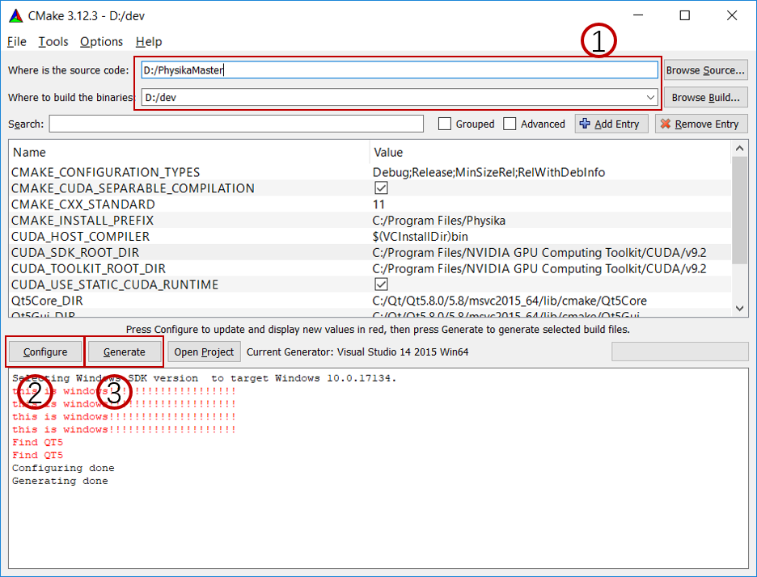
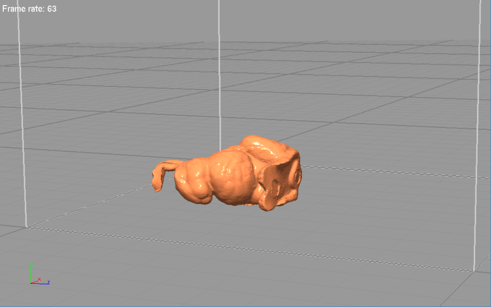

 
## Introduction

PhysIKA is an open source node-based architecture targeted at real-time simulation of versatile physical materials. Currently, it supports simulating physical phenomena ranging from fluids, elastic objects and fracture, etc.
It is higly modualized and can also help the research community develop more novel algorithms.


## Getting Started

The following instructions will guide you to set up an simple elastic object.

### Prerequisites

- CUDA 9.0 +
- CMake 3.12 + 

### Installing

- Download the source code;
- Run cmake and set up both "Where is the source" and "Where to build the binaries";
- Click Configure;
- If succeeded, then click Generate.

 

## Runing an example

The following example shows how to create an elastic bunny with less than 30 lines of codes.

```
#include <iostream>
#include "GUI/GlutGUI/GLApp.h"
#include "Framework/Framework/SceneGraph.h"
#include "Dynamics/ParticleSystem/ParticleElasticBody.h"
#include "Dynamics/ParticleSystem/StaticBoundary.h"

using namespace Physika;

int main()
{
	SceneGraph& scene = SceneGraph::getInstance();

	std::shared_ptr<StaticBoundary<DataType3f>> root = scene.createNewScene<StaticBoundary<DataType3f>>();
	root->loadCube(Vector3f(0), Vector3f(1), true);

	std::shared_ptr<ParticleElasticBody<DataType3f>> bunny = std::make_shared<ParticleElasticBody<DataType3f>>();
	root->addParticleSystem(bunny);
	bunny->getRenderModule()->setColor(Vector3f(0, 1, 1));
	bunny->setMass(1.0);
	bunny->loadParticles("../Media/bunny/bunny_points.obj");
	bunny->loadSurface("../Media/bunny/bunny_mesh.obj");
	bunny->translate(Vector3f(0.5, 0.2, 0.5));
	bunny->setVisible(false);

	GLApp window;
	window.createWindow(1024, 768);

	window.mainLoop();

	return 0;
}
```
The following image shows an screenshot of the running example

 

## Contributers

### Current developers:

* **He Xiaowei** - *Institute of Software, CAS*
* **Xu Liyou** - *Peking University*

See also the list of [contributors](https://github.com/PhysikaTeam/PhysIKA/graphs/contributors) who are currently participated in this project.

### Former developers:
* **Chen Wei**
* **Zhu Fei**
* **Yang Sheng**
* **Zhang Tianxiang**

## License

This project is licensed under the GNU License - see the [LICENSE](LICENSE) file for details


